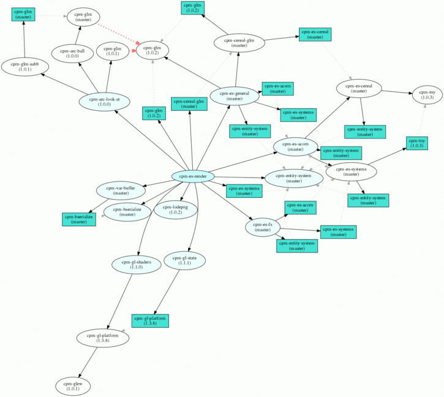

CPM
===

[](https://travis-ci.org/iauns/cpm)

**Note** CPM is not being actively maintained. I plan on keeping the website
active but don't plan on making further modifications to the codebase. If
anyone is interested in moving the project forward please contact me (iauns)
by sending an e-mail or opening an issue.

A C++ Package Manager based on CMake and Git.

CPM is designed to promote small, well-tested, composable C++ modules. CPM
allows you to link against multiple different versions of the same static
library without symbol conflicts. You can include other C++ modules that may
depend on older or newer versions of the same modules you are using.
Additionally, CPM will automatically download and build C++ modules for you. To
explore CPM's ecosystem head over to the CPM website: http://cpm.rocks .

You can manage C or C++ libraries that do not utilize CPM. A number of
'external' modules are already listed on the website. These modules abstract
away the details of downloading, building, and linking against various
projects. Just be aware that you cannot statically link against multiple
different versions of these 'external' modules because they are not built as
CPM modules and do not manage symbols like real CPM modules do.

For an example of a module with various interdependencies, check out
[cpm-es-render](http://cpm.rocks/mod/gh/iauns/cpm-es-render). Here's an
example dependency graph that the cpm website automatically generated for this
module:

[](http://cpm.rocks/mod/gh/iauns/cpm-es-render)

**Table of Contents**

- [Brief Example](#brief-example)
- [Using CPM](#using-cpm)
  - [Quick Setup](#quick-setup)
  - [Things to Note](#things-to-note)
- [Building CPM Modules](#building-cpm-modules)
  - [CMakeLists.txt Entry](#cmakeliststxt-entry)
  - [Library target name](#library-target-name)
  - [Wrapping Namespace](#wrapping-namespace)
  - [Directory Structure](#directory-structure)
  - [Exporting Build Info](#exporting-build-info)
  - [Registering Your Module](#registering-your-module)
  - [Building Externals](#building-externals)
- [CPM Function Reference](#cpm-function-reference)
  - [General Purpose](#general-purpose)
  - [Modules Only](#modules-only)
- [Miscellaneous Issues and Questions](#miscellaneous-issues-and-questions)

Brief Example
=============

Below is a sample of a CMakeLists.txt file that uses 3 modules. These modules
are: platform specific OpenGL headers, an axis aligned bounding box
implementation, and G-truc's GLSL vector math library. See the next section
for a full explanation of how to use CPM. The following CMakeLists.txt is
self-contained and will build as-is:

```cmake
  cmake_minimum_required(VERSION 2.8.7 FATAL_ERROR)
  project(foo)

  #------------------------------------------------------------------------------
  # Required CPM Setup - no need to modify - See: https://github.com/iauns/cpm
  #------------------------------------------------------------------------------
  set(CPM_DIR "${CMAKE_CURRENT_BINARY_DIR}/cpm_packages" CACHE TYPE STRING)
  find_package(Git)
  if(NOT GIT_FOUND)
    message(FATAL_ERROR "CPM requires Git.")
  endif()
  if (NOT EXISTS ${CPM_DIR}/CPM.cmake)
    message(STATUS "Cloning repo (https://github.com/iauns/cpm)")
    execute_process(
      COMMAND "${GIT_EXECUTABLE}" clone https://github.com/iauns/cpm ${CPM_DIR}
      RESULT_VARIABLE error_code
      OUTPUT_QUIET ERROR_QUIET)
    if(error_code)
      message(FATAL_ERROR "CPM failed to get the hash for HEAD")
    endif()
  endif()
  include(${CPM_DIR}/CPM.cmake)

  #------------------------------------------------------------------------------
  # CPM Modules
  #------------------------------------------------------------------------------

  # ++ MODULE: OpenGL platform
  CPM_AddModule("gl_platform"
    GIT_REPOSITORY "https://github.com/iauns/cpm-gl-platform"
    GIT_TAG "1.3.5")

  # ++ MODULE: aabb
  CPM_AddModule("aabb"
    GIT_REPOSITORY "https://github.com/iauns/cpm-glm-aabb"
    GIT_TAG "1.0.3")

  # ++ EXTERNAL-MODULE: GLM
  CPM_AddModule("glm"
    GIT_REPOSITORY "https://github.com/iauns/cpm-glm"
    GIT_TAG "1.0.2"
    USE_EXISTING_VER TRUE)

  CPM_Finish()

  #-----------------------------------------------------------------------
  # Setup source
  #-----------------------------------------------------------------------

  # NOTE: Feel free to ignore this section. It simply creates a main.cpp source
  # file from scratch instead of relying on the source being present. This is
  # done only to keep this CMakeLists.txt self-contained.

  file(WRITE src/main.cpp "#include <iostream>\n")
  file(APPEND src/main.cpp "#include <glm-aabb/AABB.hpp>\n")
  file(APPEND src/main.cpp "#include <glm/glm.hpp>\n\n")
  file(APPEND src/main.cpp "namespace glm_aabb = CPM_AABB_NS;\n\n")
  file(APPEND src/main.cpp "int main(int argc, char** av)\n")
  file(APPEND src/main.cpp "{\n")
  file(APPEND src/main.cpp "  glm_aabb::AABB aabb(glm::vec3(-1.0), glm::vec3(1.0));\n")
  file(APPEND src/main.cpp "  aabb.extend(glm::vec3(-2.0, 3.0, -0.5));\n")
  file(APPEND src/main.cpp "  glm_aabb::AABB aabb2(glm::vec3(1.0), 1.0);\n")
  file(APPEND src/main.cpp "  std::cout << \"AABB Interesction: \" << aabb.intersect(aabb2) << std::endl;\n")
  file(APPEND src/main.cpp "  return 0;\n")
  file(APPEND src/main.cpp "}\n")

  set(Sources src/main.cpp)

  #-----------------------------------------------------------------------
  # Setup executable
  #-----------------------------------------------------------------------
  set(EXE_NAME cpm-test)
  add_executable(${EXE_NAME} ${Sources})
  target_link_libraries(${EXE_NAME} ${CPM_LIBRARIES})
```

Using CPM
=========

Quick Setup
-----------

To use CPM in your C++ project, include the following at the top of your
CMakeLists.txt:

```cmake
  #------------------------------------------------------------------------------
  # Required CPM Setup - no need to modify - See: https://github.com/iauns/cpm
  #------------------------------------------------------------------------------
  set(CPM_DIR "${CMAKE_CURRENT_BINARY_DIR}/cpm-packages" CACHE TYPE STRING)
  find_package(Git)
  if(NOT GIT_FOUND)
    message(FATAL_ERROR "CPM requires Git.")
  endif()
  if (NOT EXISTS ${CPM_DIR}/CPM.cmake)
    message(STATUS "Cloning repo (https://github.com/iauns/cpm)")
    execute_process(
      COMMAND "${GIT_EXECUTABLE}" clone https://github.com/iauns/cpm ${CPM_DIR}
      RESULT_VARIABLE error_code
      OUTPUT_QUIET ERROR_QUIET)
    if(error_code)
      message(FATAL_ERROR "CPM failed to get the hash for HEAD")
    endif()
  endif()
  include(${CPM_DIR}/CPM.cmake)
  
  #------------------------------------------------------------------------------
  # CPM Modules
  #------------------------------------------------------------------------------

  # TODO: Include any modules here...
  
  CPM_Finish()

```

Then add the ``${CPM_LIBRARIES}`` variable to your ``target_link_libraries``
similar to the following:

```cmake
target_link_libraries(my_project ${CPM_LIBRARIES}) 
```

And you're done. You will be able to start using CPM modules right away by
adding the following snippet to the CPM Modules section of your
CMakeLists.txt:

```cmake
  CPM_AddModule("aabb"
    GIT_REPOSITORY "https://github.com/iauns/cpm-glm-aabb"
    GIT_TAG "1.0.2")
```

This snippet will automatically download, build, and link version 1.0.2 of a
simple axis aligned bounding box implementation named `aabb`. A new namespace
is generated for `aabb` and a preprocessor definition for this namespace is
automatically added to your project. The preprocessor namespace definition
always follows the form ``CPM_<NAME>_NS`` where ``<NAME>`` is the capitalized
first argument of your call to ``CPM_AddModule``.

For example, in the 'aabb' snippet above, the first argument to
`CPM_AddModule` was "aabb" so the preprocessor definition ``CPM_AABB_NS``
would be added to our project. This declares the namepsace under which CPM has
bound the 'aabb' module. For instance, aabb's only class is named `AABB`. So
the fully qualified name for the `AABB` class would be: `CPM_AABB_NS::AABB`.
You may want to rename the namespace to something more appropriate:
``namespace glm_aabb = CPM_AABB_NS;``. But that's entirely up to you.
Depending on your needs, using the CPM namespace as-is may be all you need.

Be sure to place all calls to `CPM_AddModule` before your call to
`CPM_Finish`. The ``# TODO: Include any modules here...``
section mentioned in the first snippet indicates where you should place calls
to ``CPM_AddModule``.

Why even bother with these preprocessor namespace definitions? The reason is
so that we can leverage multiple different versions of a single CPM module in
the same static linkage unit. Why would we want to let users utilize multiple
versions of our module in the first place? In many cases, users won't know
that they are actually using multiple different versions of your module. For
example, a more recent version of your module may be included directly by the
user, but an older version of your module may be pulled in as a dependency of
another module the user is relying on. If you're interested, you can see CPM's
[dependency graph](#dependency-hierarchy) for your project.

Things To Note
--------------

### Includes

Every module's root directory will be added to your include path. It is common
that every module's github page describes what file or files you should
include in your project. The paths to these files will be relative to the
module's root directory. So you can copy the include directive directly from
the module's github page into your code. For example, to access AABB's
functionality we would include its interface header file like so:

```
#include <glm-aabb/AABB.hpp>
```

### Compiler Flags

If you have compiler flags you wish to apply to all modules, then add them
directly before the CPM section in your CMakeListst.txt. Since each call to
`CPM_AddModule` uses `add_subdirectory` internally, every module will inherit
your compiler flags (for good or bad).

### CPM Externals

If the library you are interested in isn't a CPM module, try browsing through
the CPM externals listed on http://cpmcpp.com. Just use `CPM_AddModule` as you
would with any other module. Note that you will likely want to use the
`USE_EXISTING_VER` parameter to `CPM_AddModule` in conjunction with external
modules.

If you don't find a formula for your favorite library, kindly consider
contributing one to our CPM modules repository.

### Tag Advice

While it may be tempting to use the `origin/master` tag to track the most
recent changes to a module, it is not recommended. Using version tags for a
module (such as `1.0.2`) and upgrading modules when necessary will save you
time in the long run. If you track `origin/master` and upstream decides to
release a major version which includes significant API changes then your
builds will likely break immediately. But if versioned tags are used, you
will maintain your build integrity even through upstream version upgrades.

### Advantages

* Automatically manages code retrieval and building of CPM modules and externals.
* Allows the use of multiple different versions of the same statically linked
  module in the same executable.
* Built entirely in CMake. Nothing else is required.
* All CPM module code will be included in any generated project solution.
* Will automatically detect preprocessor naming conflicts.
* Optionally cache downloaded modules and repositories to a central directory.

### Limitations

* Only supports git (with very limited support for SVN).


Building CPM Modules
====================

If you only want to use pre-existing CPM modules and aren't interested in
building modules yourself, feel free to skip this section. But, if you are
interested in building CPM modules then please read on as some guidelines and
requirements are listed below.

CMakeLists.txt Entry
--------------------

There must be a CMakeLists.txt at the root of your module project and this
CMakeLists.txt file must contain all relevant CPM directives and code (see
below). Do not use issue calls to CPM (``CPM_*``) in a subdirectory
(``add_subdirectory``).

Add the following to the top of the CMakeLists.txt for your module:

```cmake
  #-----------------------------------------------------------------------
  # CPM configuration
  #-----------------------------------------------------------------------
  set(CPM_MODULE_NAME <name>)
  set(CPM_LIB_TARGET_NAME ${CPM_MODULE_NAME})
  
  if ((DEFINED CPM_DIR) AND (DEFINED CPM_UNIQUE_ID) AND (DEFINED CPM_TARGET_NAME))
    set(CPM_LIB_TARGET_NAME ${CPM_TARGET_NAME})
    set(CMAKE_MODULE_PATH ${CMAKE_MODULE_PATH} ${CPM_DIR})
    include(CPM)
  else()
    set(CPM_DIR "${CMAKE_CURRENT_BINARY_DIR}/cpm-packages" CACHE TYPE STRING)
    find_package(Git)
    if(NOT GIT_FOUND)
      message(FATAL_ERROR "CPM requires Git.")
    endif()
    if (NOT EXISTS ${CPM_DIR}/CPM.cmake)
      message(STATUS "Cloning repo (https://github.com/iauns/cpm)")
      execute_process(
        COMMAND "${GIT_EXECUTABLE}" clone https://github.com/iauns/cpm ${CPM_DIR}
        RESULT_VARIABLE error_code
        OUTPUT_QUIET ERROR_QUIET)
      if(error_code)
        message(FATAL_ERROR "CPM failed to get the hash for HEAD")
      endif()
    endif()
    include(${CPM_DIR}/CPM.cmake)
  endif()
  
  # Include CPM modules or externals here (with CPM_AddModule).
  
  CPM_InitModule(${CPM_MODULE_NAME})
```

Be sure to update the ``<name>`` at the beginning of the snippet. ``<name>`` 
is placed in the namespace preprocessor definition for your module. For example,
if ``<name>`` is 'spire' then the preprocessor definition that will be added
to your project will be ``CPM_SPIRE_NS``. Use this definition as a wrapper
around your code and namespaces. Don't worry about users using the same name in
their call to `CPM_AddModule` as the name you choose in your call to
`CPM_InitModule`. CPM will automatically handle this for you. Also use
``CPM_LIB_TARGET_NAME`` as the name of your library in `add_library` and include
``CPM_LIBRARIES`` in `target_link_libraries` for your static library. Example:

```cmake
  # Our CPM module library
  add_library(${CPM_LIB_TARGET_NAME} ${Source})
  target_link_libraries(${CPM_LIB_TARGET_NAME} ${CPM_LIBRARIES})
```

Here is an example class that demonstrates the namespace wrapping:

```cpp
  namespace CPM_SPIRE_NS {

  ... code here ...

  } // namespace CPM_SPIRE_NS
```

Library target name
-------------------

If you used the code snippet above make sure that your generated library target
name is `${CPM_LIB_TARGET_NAME}`. This will ensure your library target name 
matches with what CPM is expecting. But, if you can't name your target
`${CPM_LIB_TARGET_NAME}` for any reason, use `CPM_ExportAdditionalLibraryTarget`
instead in order name your target whatever you would like. See the function
reference below.

Wrapping Namespace
------------------

CPM allows multiple different versions of the same module to be statically
linked into the same target . As such, when you are building a module for CPM
(not when you are using CPM modules!), you should either surround your
top-level namespaces in `CPM_[module name]_NS` tags or use `CPM_[module
name]_NS` as your top level namespace, like so:

```cpp
  namespace CPM_[module name]_NS {

    ...  

  } // namespace CPM_[module name]_NS
```

The first argument given to `CPM_InitModule` becomes ``[module name]`` in your
application.

Note that this is *not* required but it is *heavily* recommended when you are
building CPM modules. You must include this if you want your users to be able
to use multiple versions of your module within the same static linkage unit.

Directory Structure
-------------------

In order to avoid header name conflicts CPM modules adhere to the directory
following structure:

```
  Root of [module name]
    |-> CMakeLists.txt
    |-> test
    |-> [module name]
      |-> [public headers go here]  
      |-> src
        |-> [private headers and source code]
```

Using this structure users would include your public headers using:

```
  #include <[module name]/interface.h>
```
Exporting Build Info
--------------------

### Include Paths

By default, the root of your project is added to the include path. If you need
to expose more directories to the consumer of your module use the
``CPM_ExportAdditionalIncludeDir`` function to add directories to the
consumer's include path. The first and only argument to
``CPM_ExportAdditionalIncludeDir`` is the directory you want to add to the
path. Be sure to clearly document any changes you make to the include path in
your module's README.

### Definitions

Just as with the include paths above you can set preprocessor definitions for
the consumer. Use the function ``CPM_ExportAdditionalDefinition``, like below:

```
  CPM_ExportAdditionalDefinition("-DMONGO_HAVE_STDINT")
```

### Targets

If you have additional targets, or don't want to use the target name that
CPM generates for you, you can use the `CPM_ExportAdditionalLibraryTarget`
function that comes with CPM.

```
  CPM_ExportAdditionaLibraryTarget("MyTargetName")
```

This target will be added to the `target_link_libraries` call issued by the
consumer of your module.

Registering Your Module
-----------------------

Once you have finished writing your module, add your repository to the
ecosystem using the [CPM website](http://cpm.rocks/mod/add). A dependency
graph will be automatically generated for your module, and you will be able to
see others using your module.

Note that this step is *not* mandatory. You can use your module without
registering it by pointing CPM to the URL of your git repository. Module
registration is recommended because it makes it easier for others to find.

Building Externals
------------------

If you are wrapping non-CPM code then you are likely building a CPM external.
Building an external is just like building a module except for a call to:

```
  CPM_ForceOnlyOneModuleVersion()
```

somewhere in your module's CMakeLists.txt file. This function ensures exactly
one (and only one) version of your module is ever statically linked.

In addition to this, you should reference the original repository in your
cpm-modules JSON file by adding the 'externalURL' key/value pair. The key being
'externalURL' and the value being be a URL locating the repository for which you
have created this external. Also set the 'external' key to 'true' in your JSON
file so that the CPM website knows you have built an external. For an example
see: [CPM External for Google Test](https://github.com/iauns/cpm-modules/blob/master/iauns/google_test.json).

CPM Function Reference
======================

All CMake functions that CPM exposes are listed below.

General Purpose
---------------

### CPM_AddModule

Adds a CPM module to your project. All arguments except `<name>` are optional.
Additionally, one of either the `GIT_REPOSITORY` or `SOURCE_DIR` arguments
must be present in your call to `CPM_AddModule`. Should be called before
either `CPM_Finish` or `CPM_InitModule`

```cmake
  CPM_AddModule(<name>           # Required - Module target name. Used to generate your 
                                 # preprocessor definition.
    [GIT_REPOSITORY repo]        # Git repository that corresponds to a CPM module.
                                 # If this argument is not specfied, then SOURCE_DIR must be set.
    [GIT_TAG tag]                # Git tag to checkout. Tags, shas, and branches all work.
    [USE_EXISTING_VER truth]     # If set to true, and an existing version of this module is 
                                 # found then the existing version of this module is used
                                 # instead of the version indicated by GIT_TAG.
    [SOURCE_DIR dir]             # Uses 'dir' as the source directory instead of cloning
                                 # from a repo. If this is not specified, then 
                                 # GIT_REPOSITORY must be specified.
    [SOURCE_GHOST_GIT_REPO repo] # Ghost repository when using SOURCE_DIR.
                                 # Used to correctly correlate SOURCE_DIR modules with their 
                                 # correct upstream repository.
    [SOURCE_GHOST_GIT_TAG tag]   # Ghost git tag when using SOURCE_DIR.
    [EXPORT_MODULE truth]        # If true, then this module's (<name>) definitions and includes
                                 # will be exported to any consumer of your module.
    [FORWARD_DECLARATION truth]  # If true, then only the module's preprocessor definition 
                                 # (that the <name> argument above is used to generate) 
                                 # is exported to the consumer of the module. This is useful 
                                 # for situations where you only need to forward declare a 
                                 # module's classes in your interface classes and not actually 
                                 # include the target module's interface headers. This is 
                                 # preferred over EXPORT_MODULE.
    )
```

### CPM_EnsureRepoIsCurrent

A utility function that allows you to download and ensure that some repository
is up to date and present on the filesystem before proceeding forward with
CMakeLists.txt processing. Useful for building CPM externals. You can use this
function outside of any call to CPM_Finish or CPM_InitModule

```cmake
  CPM_EnsureRepoIsCurrent(
    [TARGET_DIR dir]             # Required - Directory in which to place repository.
    [GIT_REPOSITORY repo]        # Git repository to clone and keep up to date.
    [GIT_TAG tag]                # Git tag to checkout.
    [SVN_REPOSITORY repo]        # SVN repository to checkout.
    [SVN_REVISION rev]           # SVN revision.
    [SVN_TRUST_CERT 1]           # Trust the Subversion server site certificate
    [USE_CACHING 1]              # Enables caching of repositories if the user 
                                 # has specified CPM_MODULE_CACHING_DIR.
                                 # Not enabled by default.
    )
```

### CPM_Finish

This function is for the top-level application only. Call when you are
finished issuing calls to `CPM_AddModule`.

```cmake
CPM_Finish()
```

Modules Only
------------

The functions listed in this section are used exclusively for constructing
modules. If you use one of these functions in non-module code, a CMake warning
will be generated and the function call will be ignored.

### CPM_InitModule

This function is the module's counterpart to `CPM_Finish`. Call this to
indicate to CPM that you have finished issuing calls to `CPM_AddModule`.
The only argument indicates the name of the module. This name will only be
used for generating the preprocessor definition you should use for your
module.

```cmake
CPM_InitModule("my_module")
```

### CPM_ExportAdditionalDefinition

When building modules, this exports an additional definition in the module
consumer's scope. Use sparingly. Primarily used to expose mandatory external
project definitions.

```cmake
CPM_ExportAdditionalDefinition("-DMY_DEFINITION=42")
```

### CPM_ExportAdditionalIncludeDir

Exposes an additional include directory to the consumer of a module.
Use sparingly. Primarily used to expose external project directories
to module consumers.

```cmake
CPM_ExportAdditionalIncludeDir("./foo/bar")
```

Note, for this function, do not quote lists of include directories. Pass the
list in as-is.

### CPM_ExportAdditionalLibraryTarget

This function is mostly used to avoid having to name targets per the
`${CPM_TARGET_NAME}` convention in CPM. For an example of its use see
http://github.com/iauns/cpm-google-test. Google test itself generates its own
target name when included as a subdirectory so we must use that name.

```cmake
CPM_ExportAdditionalLibraryTarget("my_target")
```

Miscellaneous Issues and Questions
==================================

Below are some common issues users encounter and solutions to them.

When are modules downloaded and updated?
----------------------------------------

During the CMake configure step. No repository cloning or fetching occurs
during the build step.

Exposing foreign module interfaces
----------------------------------

Some modules require the ability to expose classes from other modules through
public headers. This is allowed by tagging the module that you plan on
exporting with ``EXPORT_MODULE TRUE`` just like:

```
  CPM_AddModule("GLM"
    GIT_REPOSITORY "https://github.com/iauns/cpm-glm"
    GIT_TAG "origin/master"
    USE_EXISTING_VER TRUE
    EXPORT_MODULE TRUE    # Use EXPORT_MODULE sparingly. We expose GLM's interface
    )                     # through our own interface hence why we export it.
```

In this case, GLM's definitions and include paths will be exported to the
direct consumer of your module. It will not export this module to any parents
of your consumer.

Using an existing module version
--------------------------------

CPM allows you the flexibility of selecting the most recently used version of a
particular module instead of the version you requested. This is useful when you
are working with externals or modules that require you to only use one version.
Simply add ``USE_EXISTING_VER TRUE`` in your call to ``CPM_AddModule``. An
example of this is given above in the section on exposing foreign module
interfaces.

For example, if a module you added (lets call this module `B`) requested
version `v0.9.5` of module `A`, and you subsequently requested `v0.9.1` of
module `A`, then your version would be upgraded to `v0.9.5` to comply with the
pre-existing version of the module if you specified `USE_EXISTING_VER TRUE`
when adding module `A`. It is considered best practice to set
`USE_EXSTING_VER` to `TRUE` when adding *externals* (not regular modules) to
your project. Especially when building modules for others to use. But also be
aware that your version can be *downgraded* in the same manner. You can
generally avoid being downgraded by re-arranging the order of your calls to
`CPM_AddModule`.

When adding regular non-external modules, you may consider using this
option to reduce the size of your executable if multiple different versions of
the same module are being used. Just be weary of compiler errors due to
version conflicts. In most cases, this option should be avoided when using
regular, non-external, CPM modules.

Force only one module version
-----------------------------

As pointed out in the externals section you may force all consumers, indirect
or direct, of your module to use only one version. Most module creators won't
need to worry about this corner case, but it is required that all externals
use this. Include a call to ``CPM_ForceOnlyOneModuleVersion`` anywhere in
your module's CMakeLists.txt file to enforce this. Usually this call is made
directly before calling ``CPM_InitModule``.

If you do this, you should indicate that your module is an 'external' in your
module's JSON file. Even if you don't use any external code. It is important
to separate these modules from 'regular' modules, and the nomenclature we have
chosen for these types of modules are 'externals'.

Downloading repos without external projects
-------------------------------------------

CPM provides a utility function that allows you to download repositories at
configuration time. This function is: `CPM_EnsureRepoIsCurrent`. This function
will also ensure the tag you specify is up to date and the repo is present
before continuing execution of CMakeLists.txt. You can download both git
repositories and SVN repositories using this function. For a reference
regarding the function's parameters, see the comments at the top of CPM.cmake.

For examples of using this function, see the
[google test](https://github.com/iauns/cpm-google-test) CPM external.


How do I cache modules?
-----------------------

CPM supports cached repositories and modules by setting either the
`CPM_MODULE_CACHE_DIR` CMake variable or the `CPM_CACHE_DIR` environment
variable to an appropriate cache directory (such as `~/.cpm_cache`). When
set, a search will be performed in the cache directory for all modules that
don't already exist in your project's build directory. If the module is not
found in the cache directory, CPM will download the module into the cache
directory. This is useful if you find yourself with no or limited internet
access from time to time as your cache directory will be searched before
attempting to download the repository from the internet.

Here's a quick example of using this variable from the command line:

```
  cmake -DCPM_MODULE_CACHE_DIR=~/.cpm_cache ...
```

The cache directory is searched only when a module is not found in your
project's build directory. If the module is then found in the cache directory,
the cache directory will be updated using the appropriate SCM and its
directory contents will be copied into your project's build directory. Any
subsequent invokation of CMake will find the module in your project's build
directory and will not search in the cache directory. Unless you have cleaned
the project or removed the build directory's modules.

How do I cache CPM itself?
--------------------------

Use the following code snippet instead of the one given above. This snippet
checks to see if CPM exists in the cache directory before attempting to
download it.

```cmake
#------------------------------------------------------------------------------
# Required CPM Setup - See: http://github.com/iauns/cpm
#------------------------------------------------------------------------------
set(CPM_DIR "${CMAKE_CURRENT_BINARY_DIR}/cpm-packages" CACHE TYPE STRING)
find_package(Git)
if(NOT GIT_FOUND)
  message(FATAL_ERROR "CPM requires Git.")
endif()
if ((NOT DEFINED CPM_MODULE_CACHE_DIR) AND (NOT "$ENV{CPM_CACHE_DIR}" STREQUAL ""))
  set(CPM_MODULE_CACHE_DIR "$ENV{CPM_CACHE_DIR}")
endif()
if ((NOT EXISTS ${CPM_DIR}/CPM.cmake) AND (DEFINED CPM_MODULE_CACHE_DIR))
  if (EXISTS "${CPM_MODULE_CACHE_DIR}/github_iauns_cpm")
    message(STATUS "Found cached version of CPM.")
    file(COPY "${CPM_MODULE_CACHE_DIR}/github_iauns_cpm/" DESTINATION ${CPM_DIR})
  endif()
endif()
if (NOT EXISTS ${CPM_DIR}/CPM.cmake)
  message(STATUS "Cloning repo (https://github.com/iauns/cpm)")
  execute_process(
    COMMAND "${GIT_EXECUTABLE}" clone https://github.com/iauns/cpm ${CPM_DIR}
    RESULT_VARIABLE error_code
    OUTPUT_QUIET ERROR_QUIET)
  if(error_code)
    message(FATAL_ERROR "CPM failed to get the hash for HEAD")
  endif()
endif()
include(${CPM_DIR}/CPM.cmake)

# Modules go here...

CPM_Finish()
```

<a name="dependency-hierarchy"></a>
How do I see the module dependency hierarchy?
---------------------------------------------

When building your project define: ``CPM_SHOW_HIERARCHY=TRUE``.

On the command line this would look something like

```
  cmake -DCPM_SHOW_HIERARCHY=TRUE ...
```

It is best to run this command after you have successfully built your project
so the output is not muddied by status messages.

I get errors regarding reused binary directories
------------------------------------------------

If you get errors similar to:

```
  The binary directory

    /Users/jhughes/me/cpp/cpm/modules/ ... /bin

  is already used to build a source directory.  It cannot be used to build
  source directory.
```

This means that there exists a circular module reference which is not allowed
in CPM. The module graph must not contain cycles. For example, if Module A
adds Module B, and Module B adds Module A, you will get this error.

How do I Manage CPM Namespaces?
-------------------------------

There are a number of options here. You could rename the `CPM_<NAME>_NS` at
the top of your implementation files:

```cpp
namespace Spire = CPM_SPIRE_NS;
```

Or you can build a header that renames all of the module namespaces for you.
Something akin to the following:

```cpp
  #ifndef __MY_NAMESPACES_H
  #define __MY_NAMESPACES_H

  // 'Forward declaration' of CPM module namespaces.
  namespace CPM_SPIRE_NS {}
  namespace CPM_SPIRE_SCIRUN_NS {}
  ... (more forward declarations) ...
  
  // Renaming the namespaces in our top level namespace.
  namespace my_namespace {
    namespace Spire     = CPM_SPIRE_NS;
    namespace SpireSR   = CPM_SPIRE_SCIRUN_NS;
  }

  #endif
```

Be careful with the latter header based approach since there are some
pitfalls. For example, the increased possibility of header guard confilcts
and namespace conflicts. In general, renaming the namespace at the source
level is the recommended way to go.

